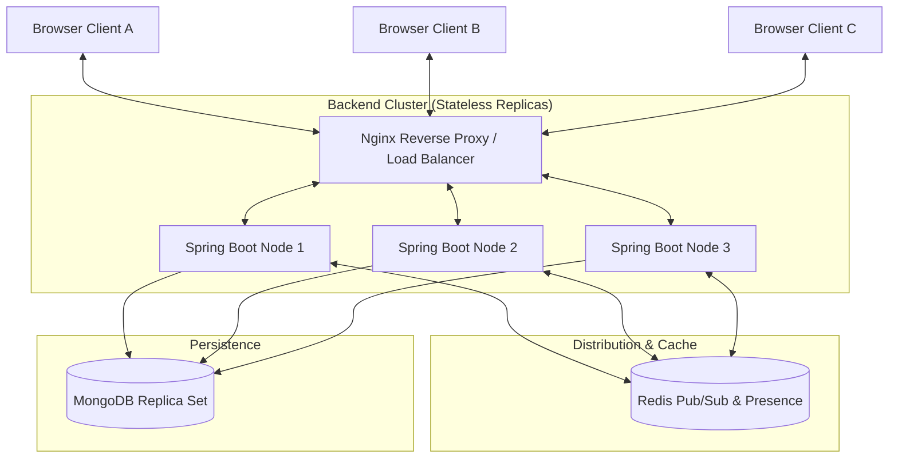

# CollabCode — Architecture & System Design

## 1. High-Level Architecture

## 2. Core Principles
1. **Yjs CRDT for Conflict-Free Real-Time Editing**: Clients generate binary delta updates. The server authenticates, validates, persists, and relays deltas without parsing AST or OT state transformations.
2. **Horizontal Scalability via Redis Pub/Sub**: Client A on Node 1 sends an update; Node 1 publishes to Redis topic `doc:{fileId}`; Node 2 and Node 3 receive the message and fan out to their locally connected WebSockets.
3. **Log-Structured Mongo Persistence**:
   - `doc_updates`: Append-only stream of binary delta updates.
   - `doc_snapshots`: Periodic compacted document states. Clients receive latest snapshot + recent updates since snapshot.
4. **Separation of Persistent vs Ephemeral State**: Presence, cursors, and awareness reside in Redis with short TTLs and never touch disk.
5. **Decoupled Chat & Live Code**: Chat operates via STOMP/WebSocket on `/topic/room.{roomId}` with cursor pagination in MongoDB, avoiding interference with high-frequency editor CRDT traffic.
